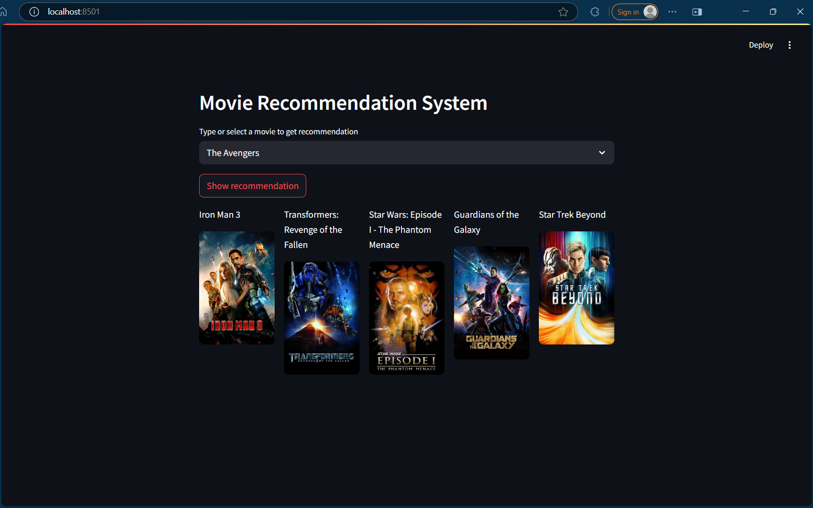

# 🎬 Movie Recommendation System

This is a content-based movie recommendation system built with **Python**, **Streamlit**, and **TMDb API**. It suggests similar movies based on the one selected by the user.

---

## 🚀 Features

- Movie selection from a dropdown
- Recommends 5 similar movies
- Displays posters using TMDb API
- Uses cosine similarity on vectorized movie data
- Built with Streamlit for a user-friendly interface

